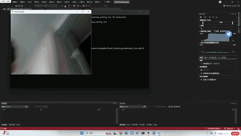

# Hand Tracking CPU — 从 MediaPipe 解耦的纯 CPU 手部追踪

[](LICENSE)
[]()
[]()

一个从 **Google MediaPipe** 中解耦出的独立手部追踪桌面端应用。纯 CPU 推理，零 GPU 依赖，通过摄像头或视频文件实时追踪手部 21 个 3D 关键点，支持多手追踪（最多 4 只）及左右手识别。



> 上图展示了 Hand Tracking 在摄像头输入下的实时运行效果：每只手 21 个关键点覆盖指尖、指关节、手腕，同时显示手掌检测框和左右手标签。

> **基于** Google [MediaPipe 0.10.10](https://github.com/google/mediapipe)，保留完整的手部追踪管线（手掌检测 + 关键点定位 + 渲染），支持 Full/Lite 双模式切换。

---

## 特性

- ✅ **零 GPU 依赖** — 纯 CPU 推理，XNNPACK SIMD 加速（SSE/AVX）
- ✅ **21 个 3D 手部关键点** — 每只手 4 个指尖 + 5 个指关节 + 手掌 + 手腕，含 x/y/z 坐标
- ✅ **多手追踪** — 支持 1~4 只手同时追踪，实时 20~30 FPS
- ✅ **左右手识别** — 自动标注左手/右手标签及置信度
- ✅ **双模型切换** — Full 模式（高精度）/ Lite 模式（更快），INI 热切换
- ✅ **管线不阻塞** — FlowLimiterCalculator 限流，确保帧不积压
- ✅ **运行时热配置** — 手数、精度模式、线程数改参不重编译
- ✅ **视频文件或摄像头输入** — 自动识别切换

---

## 管线架构

```
摄像头帧 (OpenCV)
  → HandLandmarkTrackingCpu（手掌检测 + 手部关键点追踪）
      ├── PalmDetectionCpu（192×192 全图手掌检测）
      │   └── 输出：手掌检测框 + 左右手标签
      ├── HandLandmarkCpu（224×224 手部关键点回归，21 点 x/y/z）
      │   └── 输出：21 个 3D 关键点 + 左右手置信度
      └── HandLandmarkLandmarksToRoi（关键点 → ROI，供下一帧跟踪）
  → HandRendererSubgraph（关键点 + 检测框 + 手标签渲染到图像）
  → 输出帧 (OpenCV imshow)
```

**核心设计**：手掌检测（Palm Detection）负责在大画面中定位手部位置，手部关键点模型（Hand Landmark）在检测框裁剪的 ROI 内进行精细的 21 点回归。两阶段设计兼顾了检测范围和关键点精度。

---

## 模型

### 模型规格

| 模型 | 大小 | 输入 | 输出 | 用途 |
|------|------|------|------|------|
| `palm_detection_full.tflite` | 2.3 MB | 192×192 RGB | 手掌检测框 + 左右手标签 | 第一级：手掌定位 |
| `hand_landmark_full.tflite` | 5.5 MB | 224×224 RGB | **21 个 3D 关键点** + 左右手置信度 | 第二级：关键点回归 |

### 21 个手部关键点

右手背面示意图（手指朝上，● 内数字为关键点索引）：

```
                        ●8      ●12     ●16     ●20     ← 指尖 (Tip)
                        │        │       │       │
                        ●7      ●11     ●15     ●19     ← DIP（远端指间关节）
                        │        │       │       │
      ●4（拇指尖）       ●6      ●10     ●14     ●18     ← PIP（近端指间关节）
       │                │        │       │       │
      ●3（拇指 IP）      ●5      ●9      ●13     ●17     ← MCP（掌指关节）
       │                │╲       │╲      │╲      │
      ●2（拇指 MCP）     │ ╲      │ ╲     │ ╲     │
        ╲               │  ╲     │  ╲    │  ╲    │
         ●1（拇指 CMC）──┘   ╲    │   ╲   │   ╲   │
           ╲                  ╲   │    ╲  │    ╲  │
            ╲                  ╲  │     ╲ │     ╲ │
             ╲                  ╲ │      ╲│      ╲│
              └──────●0──────────┸┸───────┸┘───────┘
                     手腕 (Wrist)

        拇指           食指     中指    无名指   小指
       Thumb          Index   Middle   Ring   Pinky
```

| 手指 | 关键点索引 | 关节层级（从掌心到指尖） |
|------|----------|------------------------|
| 手腕 | **0** | 手腕根部中心点 |
| 拇指 | **1 → 2 → 3 → 4** | CMC（腕掌关节）→ MCP（掌指关节）→ IP（指间关节）→ 指尖 |
| 食指 | **5 → 6 → 7 → 8** | MCP → PIP（近端指间关节）→ DIP（远端指间关节）→ 指尖 |
| 中指 | **9 → 10 → 11 → 12** | MCP → PIP → DIP → 指尖 |
| 无名指 | **13 → 14 → 15 → 16** | MCP → PIP → DIP → 指尖 |
| 小指 | **17 → 18 → 19 → 20** | MCP → PIP → DIP → 指尖 |

> **拇指特殊说明**：拇指只有两个指骨（近节和远节），因此只有一个指间关节（IP），而其他四指有两个指间关节（PIP + DIP）。每个关键点输出 (x, y, z) 三维坐标，z 坐标表示相对于手腕的深度，可用于手势识别和 3D 手部建模。

---

## 快速开始

### 环境要求

- **Windows 10/11 x64**
- **Visual Studio 2022 及以上**（含 C++ CMake 工具）
- **CMake** 3.16+

### 构建

```bash
cd hand_tracking
cmake -B build -S .
cmake --build build --config Release
```

产物位于 `build/Release/hand_tracking_cpu.exe`。

### 运行

```bash
cd build/Release
./hand_tracking_cpu.exe
```

默认使用摄像头 0，自动追踪手部并按 ESC 退出。

### 配置

编辑 `hand_tracking_config.ini`（构建时自动复制到 exe 同目录）：

```ini
[paths]
resource_root_dir = resource
graph_config = graphs/hand_tracking_desktop_live.pbtxt

[video]
input =                         # 视频文件路径（留空则用摄像头）
output =                        # 输出 MP4（预留）

[models]
palm_detection = mediapipe/modules/palm_detection/palm_detection_full.tflite
hand_landmark = mediapipe/modules/hand_landmark/hand_landmark_full.tflite

[detection]
num_hands = 2                   # 最大追踪手数（1~4）
model_complexity = 1            # 0 = Lite（更快），1 = Full（更准）

[execution]
num_threads = 2                 # TFLite 推理线程（0 = 自动）
xnnpack_enable = true           # XNNPACK SIMD 加速
```

### 典型场景配置推荐

| 场景 | num_hands | model_complexity | num_threads | 原因 |
|------|:---:|:---:|:---:|------|
| 单手手势识别 | 1 | 1（Full） | 2 | 最高精度，单手足够 |
| 双手交互 | 2 | 1（Full） | 4 | 需要高精度 + 多手 |
| 多人手部互动 | 4 | 0（Lite） | 4 | 多手 + 追求 FPS |
| 低配笔记本 | 1 | 0（Lite） | 1 | 最小计算开销 |

### 命令行参数

```bash
./hand_tracking_cpu.exe --input_video_path=D:/video.mp4 --config_file=D:/custom.ini
```

---

## 8 个计算子图

| 子图 | 功能 |
|------|------|
| `HandLandmarkTrackingCpu` | 顶层调度：手掌检测 + 关键点追踪 + ROI 回环 |
| `PalmDetectionCpu` | CPU 手掌检测包装器 |
| `PalmDetectionModelLoader` | 按模式加载手掌检测模型 |
| `PalmDetectionDetectionToRoi` | 手掌检测框 → 手部 ROI |
| `HandLandmarkCpu` | 手部关键点检测（224×224, 21 点） |
| `HandLandmarkModelLoader` | 按模式加载手部关键点模型 |
| `HandLandmarkLandmarksToRoi` | 关键点 → ROI（供下一帧跟踪） |
| `HandRendererSubgraph` | 关键点 + 检测框 + 手标签渲染 |

---

## 6 个自定义 TFLite 算子

与 face_mesh 共用同一套自定义算子，hand_tracking 管线需要全部 6 个：

| 算子 | 用途 |
|------|------|
| `MaxPoolingWithArgmax2D` | 最大池化 + 位置记录 |
| `MaxUnpooling2D` | 最大反池化 |
| `Convolution2DTransposeBias` | 转置卷积 + 偏置 |
| `TransformTensorBilinear` | 双线性张量变换（ROI 特征对齐） |
| `TransformLandmarks` | 关键点坐标归一化 + 旋转变换 |
| `Landmarks2TransformMatrix` | 关键点集合 → 刚体变换矩阵 |

---

## 目录结构

```
hand_tracking/
├── CMakeLists.txt                            # 构建配置（C++17, MSVC）
├── README.md / README_EN.md                  # 中英文文档
├── LICENSE                                   # Apache 2.0
├── demo/
│   └── hand_tracking.gif                     # 运行效果图
├── src/
│   ├── main.cc                               # 入口：图加载、摄像头、显示
│   ├── glog_config.h                         # GLog 预包含头文件
│   └── mediapipe/
│       ├── abseil_log/                       # Abseil 日志桩
│       ├── calculators/                      # 计算器（core/image/tensor/tflite/util）
│       ├── framework/                        # 图执行引擎、包管理
│       ├── generated_subgraphs/              # Pbtxt → C++ 子图（8 个）
│       ├── gpu/                              # GPU 缓冲管理（Image 类型，无 OpenGL）
│       ├── graphs/hand_tracking/             # 手部渲染计算器
│       ├── tflite_kernels/                   # 自定义 TFLite 算子内核
│       └── util/tflite/                      # OpResolver、自定义算子注册
├── resource/
│   ├── hand_tracking_config.ini              # 运行时配置文件
│   ├── graphs/
│   │   ├── hand_tracking_desktop_live.pbtxt  # 顶层计算图
│   │   └── hand_renderer_cpu.pbtxt           # 渲染子图
│   └── mediapipe/modules/
│       ├── palm_detection/
│       │   └── palm_detection_full.tflite    # 手掌检测模型（2.3 MB）
│       └── hand_landmark/
│           ├── hand_landmark_full.tflite     # 手部关键点模型（5.5 MB）
│           └── handedness.txt                # 左右手标签映射
├── 3rdparty/                                 # 预编译第三方依赖（~240 MB）
│   ├── tflite/  opencv/  protobuf/  abseil/
│   ├── XNNPACK/  eigen/  flatbuffers/
│   └── ...
└── cmake/
    ├── protoc.exe                            # Protocol Buffer 编译器
    └── regenerate_subgraphs.py              # Pbtxt → C++ 代码生成
```

---

## 性能数据（i7-12700H）

| 指标 | 数值 |
|------|------|
| 单帧处理耗时（Full，单手） | 8~18 ms |
| 单帧处理耗时（Full，双手） | 15~28 ms |
| 单帧处理耗时（Lite，双手） | 10~20 ms |
| 实时帧率 | 20~30 FPS |
| 内存占用 | ~180 MB |
| 可执行文件大小 | 6.8 MB |
| 模型总大小 | 7.8 MB |

---

## 与其他方案对比

| 方案 | 关键点数 | 手数 | 推理方式 | 模型大小 | CPU FPS |
|------|----------|------|----------|----------|---------|
| **本项目** | 21 (3D) | 1~4 | CPU (XNNPACK) | 7.8 MB | 20~30 |
| MediaPipe 原版 | 21 (3D) | 1~4 | CPU/GPU | 7.8 MB | 20~30 |
| OpenCV Handpose | 21 (2D) | 1 | CPU | ~2 MB | 10~20 |
| Google ML Kit | 21 (3D) | 1~2 | 移动端 GPU | — | 30 |

---

## 与 face_mesh / face_detection / hair_segmentation 的关系

四个项目同源，均从 MediaPipe 0.10.10 解耦，共享 3rdparty 依赖和 CMake 构建体系：

| 项目 | 功能 | 模型 | 子图 | 自定义算子 |
|------|------|------|------|:---:|
| face_detection | 人脸检测 + 6 点 | 1（225 KB） | 5 | 4 |
| hair_segmentation | 头发分割 + 发色 | 1（782 KB） | 0 | 0 |
| **hand_tracking（本项目）** | 手部 21 点 + 左右手 | **2（7.8 MB）** | **8** | **6** |
| face_mesh | 人脸 478 点 | 3（3.8 MB） | 12 | 6 |

hand_tracking 在复杂度上介于 hair_segmentation 和 face_mesh 之间——有 8 个子图和 6 个自定义算子，但管线结构清晰。

---

## 局限性

- **仅全手掌检测（Full）**：192×192 检测输入，超远距离手掌（< 30px）检测能力弱。可切换 Lite 模式或替换 palm_detection_lite.tflite
- **遮挡敏感**：手指交叉或握拳时，被遮挡的关键点可能出现漂移
- **仅支持 Windows**：当前仅支持 MSVC 编译，使用了 `GetModuleFileNameA` 和 DirectShow
- **无视频输出**：MP4 写入已在配置中预留，尚未实现
- **第三方库体积大**：预编译依赖约 240 MB

---

## 许可证

本项目基于 **Apache License 2.0** 开源，详见 [LICENSE](LICENSE)。

原始 MediaPipe 项目版权归 Google LLC 所有，同样采用 Apache 2.0 协议。

---

## 致谢

- [Google MediaPipe](https://developers.google.com/mediapipe) — 原始框架与模型
- [TensorFlow Lite](https://www.tensorflow.org/lite) — 推理引擎
- [XNNPACK](https://github.com/google/XNNPACK) — CPU SIMD 加速
- [OpenCV](https://opencv.org/) — 摄像头 I/O 与渲染
